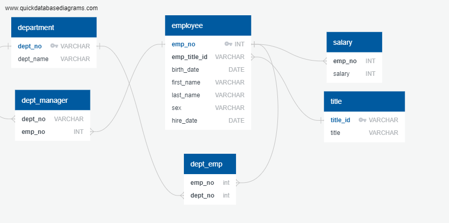

# 20210120Homework_TDY
SQL-Challenge

This homework consisted of data modeling and data engineering.
Objectives are:
- Create ERD of csv tables
- Create tables and import data
- Create various displays of the data in table format
- Use Pandas to create a histogram of salaries and a barchart showing average salary per jog title
  The tables were read into Pandas using sqlalchemy

## I. Data Modeling

The csv tables were reviewed to identify contents, columns, and data types.  

A rough sketch ERD table was created to identify initial table layout, primary keys, foreign keys, contraints, and data types.  The sketch was then transferred to a tool called quick databased diagrams.  [http://www.quickdatabasediagrams.com](http://www.quickdatabasediagrams.com). 

Path to the ERD 20210120Homework_TDY/SQL_Challenge/EmployeeSQL/data/ty_sqlchallenge_ERD_QDBD1.png

## II. Data Engineering

The ERD was used to create the appropriate tables and the data was imported.

## III. Data Analysis

The database was completed and the following queries were completed:

1. List the following details of each employee: employee number, last name, first name, sex, and salary.

Path to the Question 1 table with code 20210120Homework_TDY/SQL_Challenge/EmployeeSQL/data/Question1.PNG

2. List first name, last name, and hire date for employees who were hired in 1986.

Path to the Question 2 table with code 20210120Homework_TDY/SQL_Challenge/EmployeeSQL/data/Question2.PNG

3. List the manager of each department with the following information: department number, department name, the manager's employee number, last name, first name.

Path to the Question 3 table with code 20210120Homework_TDY/SQL_Challenge/EmployeeSQL/data/Question3.PNG

4. List the department of each employee with the following information: employee number, last name, first name, and department name.

Path to the Question 4 table with code 20210120Homework_TDY/SQL_Challenge/EmployeeSQL/data/Question4.PNG

5. List first name, last name, and sex for employees whose first name is "Hercules" and last names begin with "B."

Path to the Question 5 table with code 20210120Homework_TDY/SQL_Challenge/EmployeeSQL/data/Question5.PNG

6. List all employees in the Sales department, including their employee number, last name, first name, and department name.

Path to the Question 6 table with code 20210120Homework_TDY/SQL_Challenge/EmployeeSQL/data/Question6.PNG

7. List all employees in the Sales and Development departments, including their employee number, last name, first name, and department name.

Path to the Question 7 table with code 20210120Homework_TDY/SQL_Challenge/EmployeeSQL/data/Question7.PNG

8. In descending order, list the frequency count of employee last names, i.e., how many employees share each last name.

Path to the Question 8 table with code 20210120Homework_TDY/SQL_Challenge/EmployeeSQL/data/Question8.PNG

## IV. Bonus (Optional)

Generate visualizations of the data

The data was imported into Pandas using sqlalchemy 

Path to the image of importing database into pandas 20210120Homework_TDY/SQL_Challenge/EmployeeSQL/data/db_import_pandas.PNG

Visualization 1 - Create a histogram to visualize the most common salary ranges for employees.

Path to the image of importing database into pandas 20210120Homework_TDY/SQL_Challenge/EmployeeSQL/data/ty_HW09_salary_hist.png

Visualization 2 -  Create a bar chart of average salary by title.

Path to the image of importing database into pandas 20210120Homework_TDY/SQL_Challenge/EmployeeSQL/data/ty_HW09_avgsalarybytitle.png

## V. Epilogue

Last instruction was to search for employee ID number 499942.

Path to the Epilogue with code 20210120Homework_TDY/SQL_Challenge/EmployeeSQL/data/Epilogue.PNG

## Submission

* Create an image file of your ERD.

* Create a `.sql` file of your table schemata.

* Create a `.sql` file of your queries.

* (Optional) Create a Jupyter Notebook of the bonus analysis.
